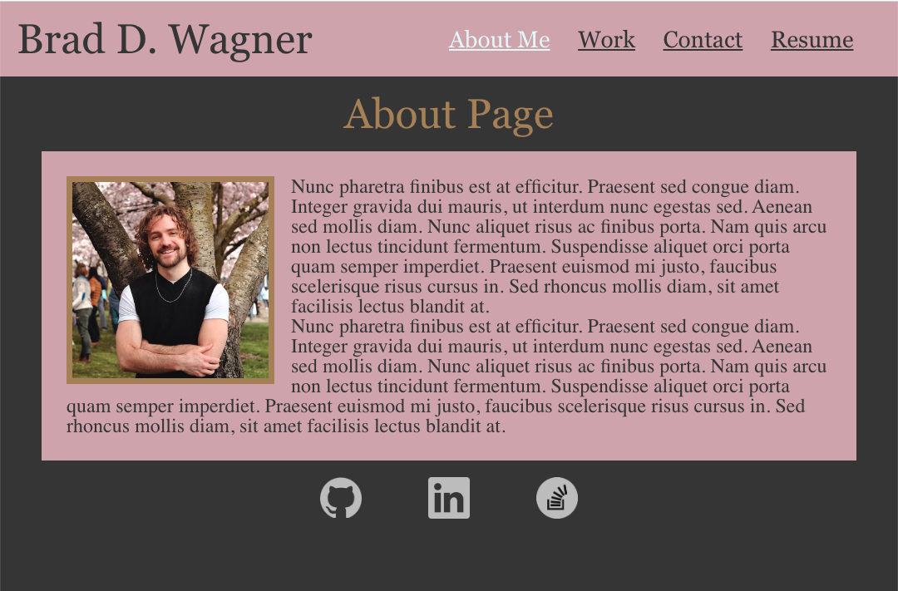

# react-portfolio
  [](https://opensource.org/licenses/MIT)

  ## Description
  This application utilizes react to create a responsive single page portfolio. Utilizing the navigation bar, the user can read up about me, contact me by sending a message, view and download my resume, and view some of my previous projects with links to their repositories and deployed sites.

  ## Table of Contents

  ♦︎[Installation](#installation)

  ♦︎[Usage](#usage)

  ♦︎[Questions](#questions)

  ## Installation

  To install the necessary dependencies, run the following command:

  ```
  npm i
  ```

  ## Usage

  The deployed application can be found [here](https://braddwagner.github.io/react-portfolio/).

  
  
  To load the application via this repository, use either ```npm run start``` to run it in development mode, or ```npm run build``` to run the build which can then be deployed via the index.html.
  Once running the application different pages can be selected from the navigation bar on the top right. The About page contains some information about me. On the Work page the user can find information and links to my previous projects by hovering over each image. On the Contact page the user can enter in their name, email, and message in order to contact me (note: back-end of the application is not yet functional so please reach out using the links in the footer). The Resume page lists my web-development proficencies as well as a link to my downloadable resume. And finally links to my GitHub and LinkedIn can be found in the footer.


  ## License

  This project is licensed under the [MIT](https://opensource.org/licenses/MIT) license.


  ## Questions

  If you have any questions about the repo, open and issue or contact me directly at braddwagner@outlook.com. You can find more of my work on my [GitHub](https://github.com/braddwagner).

